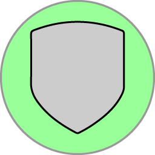
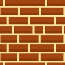

# <u>Game *"Battle Armour"*</u>

## <u>CONCEPT</u>

This game is heavily inspired on the arcade game [Tank Battalion](https://en.wikipedia.org/wiki/Tank_Battalion), created by Namco, released in 1980.
The original game was created and originally released in Japan under the name of "タンクバタリアン (Tanku Batarian)". A year later it was released to the US market.

The game was later re-released with drastic improvements under the name of [Battle City](https://en.wikipedia.org/wiki/Battle_City) as well as [Tank Force](https://en.wikipedia.org/wiki/Tank_Force).

This project will be a general recreation of the original 1980 game in Java.
The idea is that the game runs on Windows, Mac and Linux with no emulation required.

My version will be implementing something similar to the original game, with a smoother FPS and smoother movement.
I will also make custom perks and balance the game in the way I believe it is difficult enough to be engaging, but still physically doable.

## <u>GAMEPLAY</u>

The game features both single player and co-op modes. 
Players can move around the map and shoot bullets at <a href="enemies">enemies</a> and <a href="blocks">blocks</a>. 
The idea of the game is to get the <a href="#high-score">highest score</a> and compete with other teams and players. 
Skill and intuition are also a big part of the game, as the player(s) can dodge bullets, destroy enemies and blocks as shown on the image. 
There are plenty of <a href="#perks">perks</a> which can be picked up by the player(s) to give them an advantage whilst making the game more interactive.

Different <a href="enemy-types">enemy types</a> also have different properties, such as the exploding enemy which explodes on death.

A procedural spawning system is in place, which means that <a href="#enemies">enemies</a> will  spawn forever, until the player(s) lose.
The <a href="#high-score">high scores</a> are stored in a database, which can be accessed from the main menu to see their high scores.

Once the players get bored with the game, they can also <a href="#build-mode">create their own maps</a> and play on them. They can also share them with other players.
New <a href="#blocks-adding">textures and blocks</a> with customised properties can also be added to the game to change up the mechanics.

## <u>OPTIONS</u>

### <u>Settings Overview</u>

The options UI menu is currently in development. It will feature the ability to change the controls, resolution and sound volume without needing to restart the game.
All settings except for fullscreen are implemented.
As of right now, you can manually change the settings by altering the `Config.java` file.

The settings include:
- Resolution - the game will always target the biggest square resolution possible, so if you have a 1920x1080 monitor, the game will target 1080x1080.
- ~~Fullscreen - the game will run in fullscreen if this is set to true.~~
- FPS limit - the FPS limit of the game. A value between 0 and 240.
- Sound volume - the volume of the sound effects. A value between 0 and 1.
- Music volume - the volume of the music. A value between 0 and 1.
- Controls - the basic controls of the play menu.

## <u>CONTROLS</u>

The controls can be customized in the options' menu.

|                                           Player                                            | Movement Controls | Shooting Control |
|:-------------------------------------------------------------------------------------------:|:-----------------:|:----------------:|
|  1 |  `W` `A` `S` `D`  |     `SPACE`      |
|  2 |  `↑` `↓` `←` `→`  |     `ENTER`      |

<h2 style="text-decoration: underline;">ENEMIES</h2>

### <u>Enemy Information</u>
Enemies are the main threat to the player. They will try to destroy the player(s) tanks and the <a href="#block-base">base</a>. 
Enemies will procedurally spawn forever, until the player(s) lose. 
The higher the score, the faster enemies will spawn. 
The spawn tables are also weighted; the higher the score, the more likely it is for a higher tier enemy to spawn. 
With co-op, the spawn rate is increased to leverage the advantage of having more players.

<h3 style="text-decoration: underline;">Enemy Types</h3>

|                                             Image                                             |  Enemy Type   | Description                                                                                                                                                |
|:---------------------------------------------------------------------------------------------:|:-------------:|:-----------------------------------------------------------------------------------------------------------------------------------------------------------|
|          |   **BASIC**   | Weakest enemies. They are the fastest and have the least health.                                                                                           |
|          |   **HEAVY**   | Strongest enemies. They are the slowest and have the most health.                                                                                          |
|            |   **FAST**    | Fastest basic enemies.                                                                                                                                     |
|  | **EXPLODING** | Special type of enemy that explodes on death, dealing damage to the player and damaging all nearby blocks. They prefer to target the base over the player. |

<h2 style="text-decoration: underline;">PERKS</h2>

### <u>Perk Information</u>

Perks are special items which can be picked up by the player to give them an advantage. 

All perks have a timer. One the timer runs out the perk will be taken away from the player. 
Some perks also have additional properties, such as the <a href="perk-penetrating-bullets"> **PENETRATING BULLETS**</a> perk, which has a limited number of uses. 

### <u>Perk Stacking</u>

Certain perks can be stacked, and will have slightly different implementations. 
For example, the <a href="perk-double-damage"> **DOUBLE DAMAGE**</a> perk can be stacked as many times, giving the player a chance to one tap heavies or bricks. 
The <a href="perk-shield"> **SHIELD**</a> perk can be stacked as many times. Picking up will reset the timer for the shield. 
The <a href="perk-quad-shot"> **QUAD SHOT**</a> perk can be stacked as many times, it resets the number of available quad shots as well as the timer.

### <u>Perk Spawning</u>

Perks have a chance to spawn when an enemy is killed. The chance of a perk spawning is 1 in 5. 
The choice of perks is random, but the chance of a perk spawning is the same for all perks.

### <u>Perk Types</u>

|                                                                        Image                                                                        |                         Perk Type                          | Description                                                                                            |
|:---------------------------------------------------------------------------------------------------------------------------------------------------:|:----------------------------------------------------------:|:-------------------------------------------------------------------------------------------------------|
|                                |                       **QUAD SHOT**                        | Allows the player to shoot 4 bullets at once in each direction.                                        |
|                    |                     **DOUBLE DAMAGE**                      | Allows the player to deal double damage to blocks and tanks.                                           |
|                                        |                         **SHIELD**                         | Allows the player to take 1 hit before dying.                                                          |
|                                                         |                      **SPEED BOOST**                       | Allows the player to move faster.                                                                      |
|                                                             |                       **FAST SHOT**                        | Allows the player to shoot faster.                                                                     |
|                                             |                   **BULLET PROPULSION**                    | Allows the player to shoot further/faster.                                                             |
|  |                  **PENETRATING BULLETS**                   | Allows the player to shoot through multiple enemies.                                                   |
|                                             | ~~**EXPLOSIVE BULLETS**~~ | ~~Allows the player to shoot bullets which explode on impact.~~ (WIP) |

<h2 style="text-decoration: underline;">BLOCKS</h2>
### <u>Block Types</u>

|                                                   Image                                                   | Block Name | Description                                                                                            |
|:---------------------------------------------------------------------------------------------------------:|:----------:|:-------------------------------------------------------------------------------------------------------|
|  |  **BASE**  | Base the players are protecting from enemies.                                                          |
|                         | **BRICK**  | Destructible blocks which can be destroyed by the player.                                              |
|                           |  **EDGE**  | Indestructible blocks placed around the map to prevent the player from moving out and provide balance. |
|                         | **WATER**  | Special blocks allowing shots through but preventing movement.                                         |
|                           | **LEAVES** | Blocks that obstruct the view of tanks traveling below.                                                |

<h3 style="text-decoration: underline;">Automatic block adding system</h3>

Blocks can also be easily added to the game by adding a new block type to the `BlockType` enum, as well as adding a new image to the `resources/images/blocks` folder named the same as the enum.
The game will automatically pick up the new block type and use the image. You will be able to use the build menu to create a game with the new block type and play a round with the new textures!

### <u>Build mode exclusive blocks</u>

The build mode also features a block type called **NONE**. This block type is used to remove blocks from the map.

** ENEMY SPAWN** and ** PLAYER SPAWN** designated blocks are also used in build mode to place the spawn points for the enemies and players.
There can only be 2 player spawn points and unlimited enemy points. The game will automatically pick up the spawn points and use them in the game.

<h2 style="text-decoration: underline;">BUILD MODE</h2>

The build mode allows the player to create their own maps, share them and play them.
To load a map, the player must press `L` on the keyboard. This will open a file chooser, where the player can select a map file to load.
The map file must be a `.level` file. The validity of the map file is checked upon loading.

To save a map, the player must press `ESC` on the keyboard. This will open a file chooser, where the player can select a map file to save to.
The map file must be a `.level` file. The validity of the map file is checked upon saving.

To quit without saving, the player can press `BACKSPACE` on the keyboard.

To place a block, the player can left-click on the mouse. 
To cycle through the block types the player can right-click on the mouse or use `SPACE`.

## <u>HIGH SCORE</u>

The high score system stores all scores in a database. This database is currently local, but it's possible to have a remote database.
The high score system is also used to store the player's name, which is used in the high score table.
If a player has played on a map before, and they achieved a higher score, their name will be updated in the database.

Each level has a different high score table. 
When saving or selecting a file to display data for, the files are hashed and the hash is used to identify the level. 
This prevents cheating by editing the files to get a high score.

## <u>Planned features</u>

- [ ] Adding new pickups like explosive bullets (partially complete)
- [ ] Settings to change the controls and resolution (partially complete)

## <u>Copyright & Disclosure</u>

### <u>Art</u>
Some pieces of art are [DALL.E](https://openai.com/blog/dall-e/) generated images, which are licensed under the [Creative Commons Attribution 4.0 International License](https://creativecommons.org/licenses/by/4.0/).
These pieces are edited by me to fit the game. Other pieces are created by me in Illustrator and Piskel.

### <u>Code</u>
All code is written/authored by me, unless otherwise stated.

Imported additional libraries are licensed under their respective licenses, and created by their respective authors.
 
These libraries include:
- city.cs.engine - unknown licence
- javazoom.jlayer - licenced under the [Lesser General Public License (LGPL) version 2.1](https://www.gnu.org/licenses/old-licenses/lgpl-2.1)
- org.xerial.sqlite-jdbc - licenced under the [Apache License, Version 2.0](https://www.apache.org/licenses/LICENSE-2.0)
- org.jetbrains.annotations - licenced under the [Apache LSicense, Version 2.0](https://www.apache.org/licenses/LICENSE-2.0)

### <u>Fonts</u>

PressStart2P font is used in this project, which is licensed under the [SIL Open Font License](https://github.com/cityteaching/javaproject2023-Supermarcel10/blob/main/src/main/resources/legal/PressStat2P-OFL.txt).
The font is created by CodeMan38 and can be found [here](https://fonts.google.com/specimen/Press+Start+2P).

### <u>Sounds</u>

The following utilised sounds are created by [Dark Fantasy Studio](https://www.youtube.com/c/DarkFantasyStudioNicolasJeudy) and are licensed under the [Dark Fantasy Studio Licence](https://github.com/cityteaching/javaproject2023-Supermarcel10/blob/main/src/main/resources/legal/DARK_FANTASY_STUDIO_LICENCE.pdf).
These tracks are paid for and are NOT free to use. To receive a licence in your name, you must purchase the tracks from [Dark Fantasy Studio](https://www.youtube.com/c/DarkFantasyStudioNicolasJeudy).
<ul>
<li>Tank Shot (Album: Earth Spell)</li>
<li>Block Break (Album: Earth Spell)</li>
</ul>

The following utilised sounds are created by [Mixkit](https://mixkit.co/) and are licenced under the [Mixkit Sound Effects Free Licence](https://mixkit.co/license/).
<ul>
<li>Button Click</li>
<li>Game Over</li>
<li>Game Start</li>
<li>Power Up (High)</li>
<li>Power Up (Low)</li>
<li>Player Dead</li>
<li>Player Move</li>
<li>Main Menu Music</li>
</ul>

The following utilised sounds are created by [ZapSplat](https://www.zapsplat.com) and are licenced under the [Standard Licence](https://www.zapsplat.com/license-type/standard-license/).
<ul>
<li>Tank Explode</li>
</ul>

### <u>Music</u>

The below utilised music tracks are created by [Joel Steudler](https://joelstudler.ch) and are licensed under the [Joel Steudler Music Licence](https://github.com/cityteaching/javaproject2023-Supermarcel10/blob/main/src/main/resources/legal/Joel_Steudler_Music_License_Agreement_2023.pdf).
These tracks are paid for and are NOT free to use. To receive a licence in your name, you must purchase the tracks from [Joel Steudler's website](https://joelstudler.ch).

<ul>
<li>Battle At The Stones</li>
<li>Fight or Flight</li>
<li>Heroes Rise</li>
<li>Honorbound Army</li>
<li>Rise Above Darkness</li>
<li>Warband Marauders</li>
<li>Wasteland Warrior</li>
</ul>

The below utilised music tracks are created by [Dark Fantasy Studio](https://www.youtube.com/c/DarkFantasyStudioNicolasJeudy) and are licensed under the [Dark Fantasy Studio Licence](https://github.com/cityteaching/javaproject2023-Supermarcel10/blob/main/src/main/resources/legal/DARK_FANTASY_STUDIO_LICENCE.pdf).\
These tracks are paid for and are NOT free to use. To receive a licence in your name, you must purchase the tracks from [Dark Fantasy Studio](https://www.youtube.com/c/DarkFantasyStudioNicolasJeudy).

<ul>
<li>Venom</li>
</ul>
